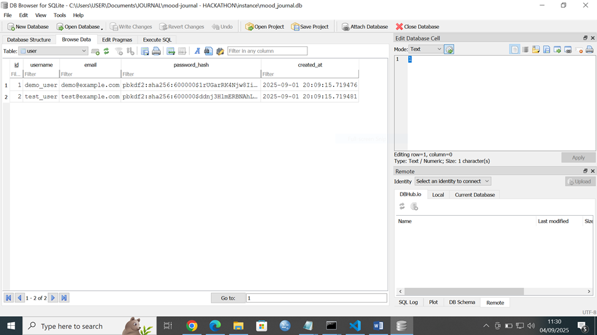

PASSSWORD IS HASHED


#KINDLY MY APP IS RUNNING BUT AM NOT ABLE TO SUBMIT IT TO GITHUB SINCE MORNING AND TODAY IS THE DEADLINE.

HAVE TRIED SEVERAL WAYS BUT GIVES ME EROOR MESSAGES

MY APP IS CALLED MOOD JOURNAL AND BELOW IS THE LINK TO THE PITCH DECK I CREATED

I HAVE ATTACHED A WORD DOCUMENT SHOWING MY WORKING AND SCREEN SHORTS FOR THE PROJECT.


# 🌟 Mood Journal - Full Stack Application

A beautiful and intuitive mood tracking application built with Flask (Python) backend and React frontend.

## ✨ Features

- **User Authentication**: Secure registration, login, and logout
- **Mood Tracking**: Add daily mood entries with notes
- **Beautiful UI**: Modern, responsive design with Tailwind CSS
- **Real-time Updates**: Instant feedback and data synchronization
- **Secure**: Password hashing, session management, and protected routes

## 🏗️ Architecture


- **Backend**: Flask with SQLAlchemy, Flask-Login, and SQLite
- **Frontend**: React with Tailwind CSS and React Router
- **Database**: SQLite with automatic schema creation
- **Authentication**: Session-based with Flask-Login

## 🚀 Quick Start

### Prerequisites

- Python 3.8+
- Node.js 16+
- npm or yarn

### Backend Setup

1. **Navigate to the backend directory:**
   ```bash
   cd /c/Users/USER/Documents/JOURNAL
   ```

2. **Create a virtual environment (recommended):**
   ```bash
   python -m venv venv
   ```

3. **Activate the virtual environment:**
   - Windows:
     ```bash
     venv\Scripts\activate
     ```
   - macOS/Linux:
     ```bash
     source venv/bin/activate
     ```

4. **Install Python dependencies:**
   ```bash
   pip install -r requirements.txt
   ```

5. **Run the Flask backend:**
   ```bash
   python app.py
   ```

   The backend will start on `http://localhost:5000`

### Frontend Setup

1. **Navigate to the frontend directory:**
   ```bash
   cd frontend
   ```

2. **Install Node.js dependencies:**
   ```bash
   npm install
   ```

3. **Start the React development server:**
   ```bash
   npm start
   ```

   The frontend will start on `http://localhost:3000`

## 📁 Project Structure

```
JOURNAL/
├── app.py                 # Main Flask application
├── models.py             # Database models (User, MoodEntry)
├── routes.py             # API routes for auth and mood entries
├── requirements.txt      # Python dependencies
├── README.md            # This file
└── frontend/            # React frontend application
    ├── package.json     # Node.js dependencies
    ├── tailwind.config.js # Tailwind CSS configuration
    ├── public/          # Static files
    └── src/             # React source code
        ├── components/   # React components
        ├── contexts/     # React contexts (AuthContext)
        ├── App.js        # Main App component
        └── index.js      # Entry point
```

## 🔐 API Endpoints

### Authentication
- `POST /auth/register` - User registration
- `POST /auth/login` - User login
- `POST /auth/logout` - User logout
- `GET /auth/me` - Get current user info

### Mood Entries
- `GET /mood/entries` - Get all mood entries for user
- `POST /mood/entries` - Add new mood entry
- `DELETE /mood/entries/<id>` - Delete mood entry

## 🎨 Frontend Components

- **Login**: User authentication form
- **Register**: User registration form
- **Dashboard**: Main application interface
- **MoodEntryForm**: Form to add new mood entries
- **MoodEntryList**: Display list of mood entries
- **Navbar**: Navigation with user info and logout

## 🛡️ Security Features

- Password hashing with bcrypt
- Session management with Flask-Login
- Protected routes requiring authentication
- Input validation and sanitization
- CORS configuration for frontend communication

## 🎯 Usage

1. **Register** a new account or **login** with existing credentials
2. **Add mood entries** using the form on the dashboard
3. **View your mood history** in the chronological list
4. **Delete entries** if needed
5. **Logout** when finished

## 🚀 Deployment

### Backend Deployment
- Update `SECRET_KEY` in production
- Use production WSGI server (Gunicorn, uWSGI)
- Configure environment variables
- Set up proper database (PostgreSQL recommended for production)

### Frontend Deployment
- Build the production version: `npm run build`
- Deploy the `build/` folder to your hosting service
- Update API base URL for production backend

## 🐛 Troubleshooting

### Common Issues

1. **Port already in use**: Change ports in `app.py` and frontend configuration
2. **Database errors**: Delete `mood_journal.db` and restart the backend
3. **CORS issues**: Ensure backend is running and CORS is properly configured
4. **Frontend not connecting**: Check if backend is running on port 5000

### Debug Mode

The Flask backend runs in debug mode by default. For production, set:
```python
app.run(debug=False)
```

## 🤝 Contributing

1. Fork the repository
2. Create a feature branch
3. Make your changes
4. Test thoroughly
5. Submit a pull request

## 📄 License

This project is open source and available under the MIT License.

## 🙏 Acknowledgments

- Flask team for the excellent web framework
- React team for the powerful frontend library
- Tailwind CSS for the utility-first CSS framework
- All contributors and users of this application

---


# Mood Journal

**Mood Journal** is a web application that allows users to track their daily moods, reflect on emotions, and maintain a personal mood diary. Built with Flask (backend) and a simple frontend, the app stores user accounts and mood entries in a database.

---

## Features

- **User Authentication:** Users can register, log in, and manage their account securely.
- **Mood Tracking:** Add, view, and manage daily mood entries.
- **Data Persistence:** Uses SQLite (or other database) to store user data and mood history.
- **API Endpoints:** Fully functional REST API for mood entries and authentication.
- **Media Support:** Attach images or screenshots to mood entries.

---

## Project Structure

mood-journal - HACKATHON/
│
├─ backend/ # Flask backend (API, models, routes)
├─ frontend/ # Frontend assets and UI
├─ media/ # Images and media files
├─ .env # Environment variables (not tracked in git)
├─ .gitignore
├─ README.md
└─ screenshot.md # Markdown version of documents/screenshots

yaml
Copy code

---

## Technologies Used

- Python 3.11+
- Flask, Flask-Login, Flask-CORS, Flask-SQLAlchemy
- SQLite for local database
- Pandoc for converting Word documents to Markdown
- JavaScript & HTML for frontend

---

## Installation

1. Clone the repository:
```bash
git clone <your-repo-url>
cd mood-journal - HACKATHON
Create and activate a virtual environment:

bash
Copy code
python -m venv venv
# Windows PowerShell
.\venv\Scripts\Activate.ps1
Install Python dependencies:

bash
Copy code
pip install -r backend/requirements.txt
Install frontend dependencies:

bash
Copy code
cd frontend
npm install
Create a .env file based on .env.example and add your keys:

ini
Copy code
SECRET_KEY=your-secret-key
DATABASE_URL=sqlite:///mood_journal.db
Running the App
Run the Flask backend:

bash
Copy code
python -m backend.app
Access the API:

cpp
Copy code
http://127.0.0.1:5000/
Use Postman or browser to test endpoints like /auth/login or /mood/add.

Testing
Test user creation and login:

bash
Copy code
python -m backend.test_login
Test mood entry creation:

bash
Copy code
python -m backend.test_mood
Notes
Do not commit your .env file to GitHub (contains sensitive keys).

All images/screenshots are stored in the media folder and tracked in Git.

You can view the SQLite database using DB Browser for SQLite.

Authors
Felix Otieno (Hackathon Participant)

License
This project is licensed under the MIT License.

yaml
Copy code
