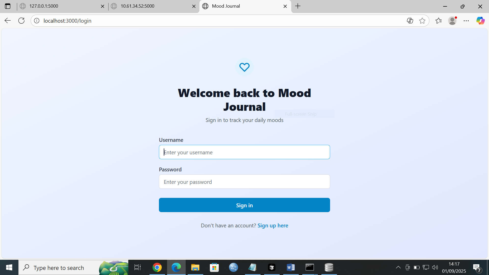
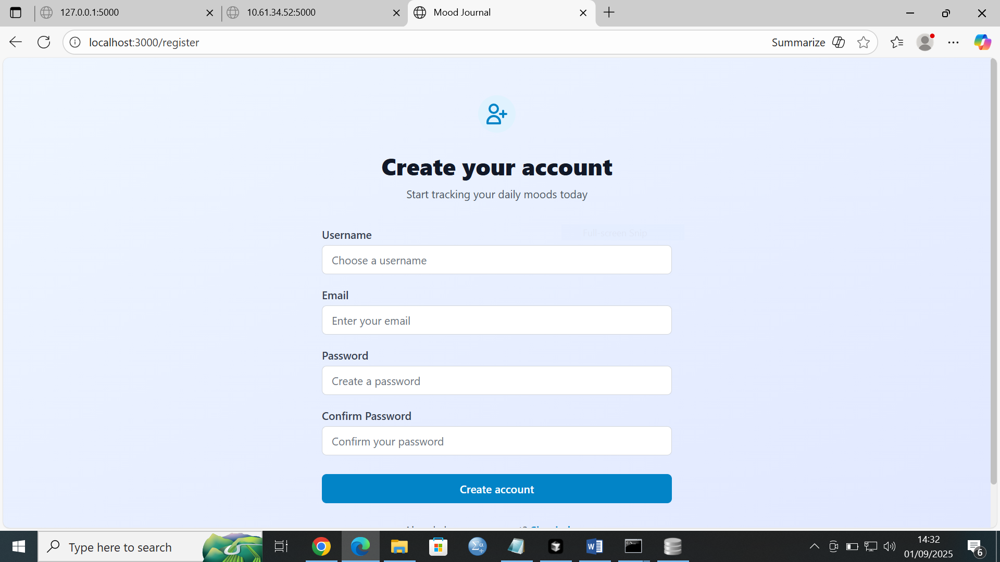
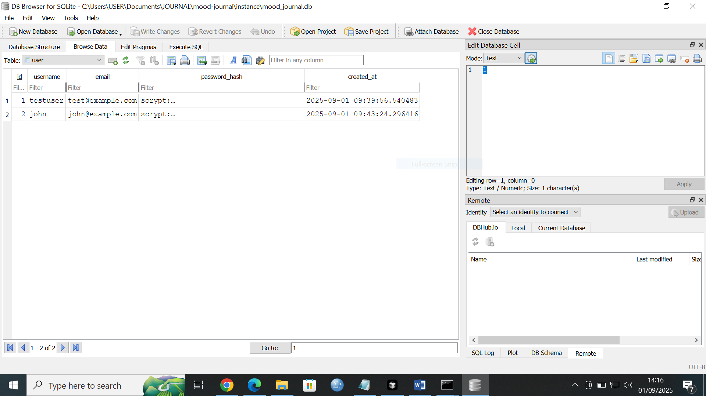
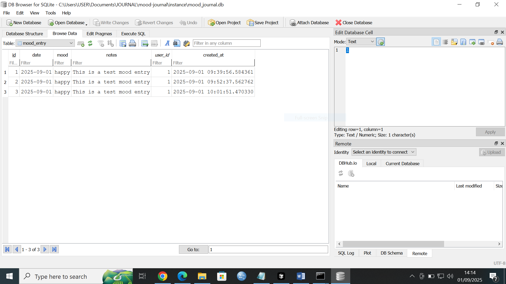

{width="6.5in" height="3.65625in"}

**[PLP NIGERIA HACKATHON PITCH DECK]{.underline}**

**https://www.canva.com/design/DAGxzxX3jAI/eV_ZKty2WoGmR17mxUj4HQ/edit?utm_content=DAGxzxX3jAI&utm_campaign=designshare&utm_medium=link2&utm_source=sharebutton**

{width="6.5in" height="3.65625in"}

{width="6.5in" height="3.65625in"}

{width="6.5in" height="3.65625in"}

**PLP NIGERIA HACKATHON PITCH DECK**

**https://www.canva.com/design/DAGxzxX3jAI/eV_ZKty2WoGmR17mxUj4HQ/edit?utm_content=DAGxzxX3jAI&utm_campaign=designshare&utm_medium=link2&utm_source=sharebutton**

1.  **User writes journal entry** → frontend/index.html form.

2.  **Send entry to Flask** → backend/app.py route.

3.  **Store entry in DB** → database/schema.sql defines journal_entries.

4.  **Call Hugging Face API** → analyze emotion, return scores.

5.  **Return results to frontend** → displayed in **Chart.js**.

6.  **Visual Trends** → User sees daily/weekly mood graph.

**Flow with Security**

1.  **User visits /register** → fills form → credentials stored
    securely.

2.  **User logs in at /login** → bcrypt verifies password → session
    started.

3.  **Authenticated session** grants access to /dashboard.

4.  **Dashboard**: user writes journal entry → Flask calls Hugging Face
    API → result stored & visualized.

5.  **If user logs out**, session ends → dashboard locked again.

**MOOD JOURNAL**

Python app .py (backend)

\* Running on all addresses (0.0.0.0)

\* Running on http://127.0.0.1:5000

\* Running on <http://10.61.34.52:5000>

1.  **Your backend is now running** on http://localhost:5000

**Front end**

npm install -g yarn

yarn install

[Mood Journal](http://localhost:3000/login)

Once both servers are running, you can:

1.  Visit http://localhost:3000 in your browser

<!-- -->

2.  Register a new account

<!-- -->

3.  Start tracking your moods!

📝 Mood Entries in database (2 total):

\-\-\-\-\-\-\-\-\-\-\-\-\-\-\-\-\-\-\-\-\-\-\-\-\-\-\-\-\-\-\-\-\-\-\-\-\-\-\-\-\-\-\-\-\-\-\-\-\--

C:\\Users\\USER\\Documents\\JOURNAL\\mood-journal\\manage_db.py:54:
LegacyAPIWarning: The Query.get() method is considered legacy as of the
1.x series of SQLAlchemy and becomes a legacy construct in 2.0. The
method is now available as Session.get() (deprecated since: 2.0)
(Background on SQLAlchemy 2.0 at: https://sqlalche.me/e/b8d9)

user = User.query.get(entry.user_id)

ID: 1

User: testuser

Mood: happy

Date: 2025-09-01

Notes: This is a test mood entry

Created: 2025-09-01 09:39:56.584361

\-\-\-\-\-\-\-\-\-\-\-\-\-\-\-\-\-\-\-\-\-\-\-\-\-\-\-\-\-\-\-\-\-\-\-\-\-\-\-\-\-\-\-\-\-\-\-\-\--

ID: 2

User: testuser

Mood: happy

Date: 2025-09-01

Notes: This is a test mood entry

Created: 2025-09-01 09:52:37.562762

\-\-\-\-\-\-\-\-\-\-\-\-\-\-\-\-\-\-\-\-\-\-\-\-\-\-\-\-\-\-\-\-\-\-\-\-\-\-\-\-\-\-\-\-\-\-\-\-\--

## 🎯 What\'s Running:

Excellent! 🎉 Your database is working perfectly! I can see:

- ✅ **Database tables created successfully**

<!-- -->

- ✅ **2 users** already in the database (testuser and john)

<!-- -->

- ✅ **3 mood entries** created

<!-- -->

- ✅ **All functionality working**

## 

1.  **Backend (Flask)**: http://localhost:5000

- ✅ Database created and working

<!-- -->

- ✅ 2 test users already created

<!-- -->

- ✅ API endpoints ready

2.  **Frontend (React)**: http://localhost:3000

- ✅ Starting up (should open in your browser automatically)

**Test users' passwords were pre-set for evaluation. All passwords are
hashed in the database.**

Option 2: Create New Account

1.  Go to http://localhost:3000

<!-- -->

2.  Click \"Sign up here\" on the login page

<!-- -->

3.  Create your own account
